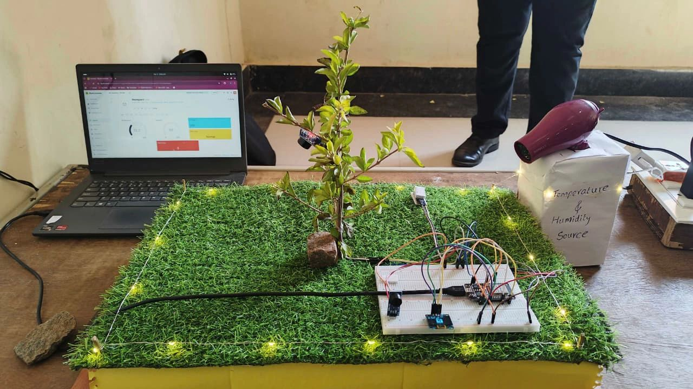
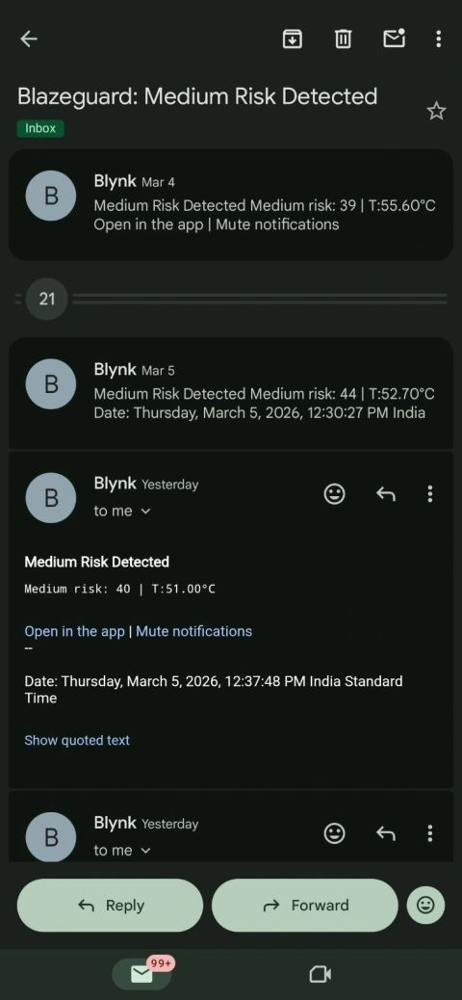
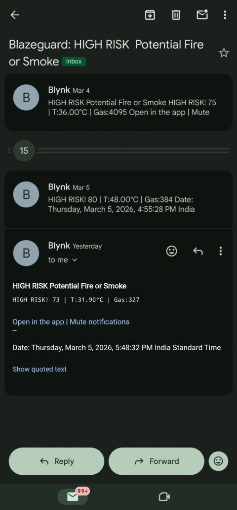
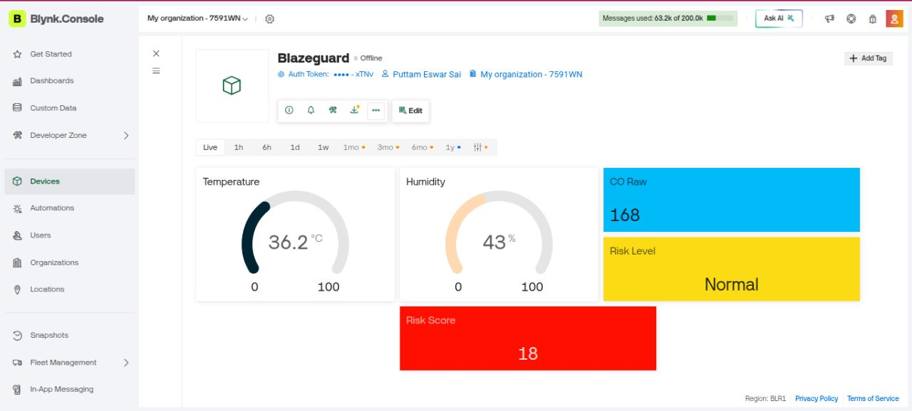
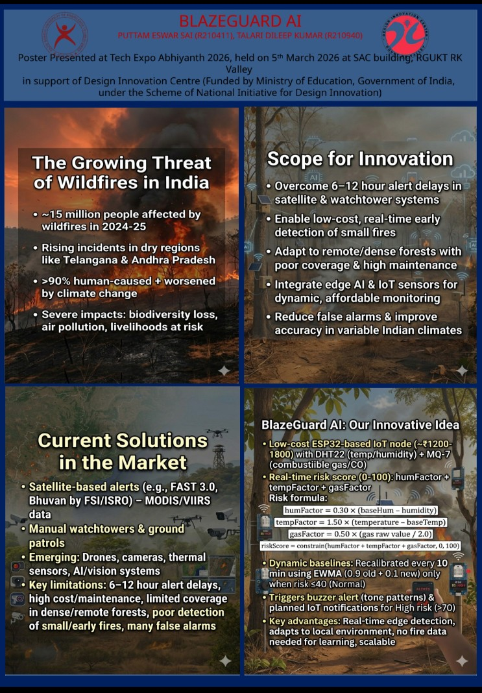

<p align="center">
  
  
  
  
  
</p>

<h1 align="center">🔥 BlazeGuard - ESP32 Wildfire Detection</h1>
<h3 align="center">Low-Cost IoT Early Warning System with Dynamic Risk Scoring & Blynk Integration</h3>

<p align="center">
  <strong>Real-time forest fire detection using ESP32 • DHT22 • MQ-7 • Adaptive baselines • OLED display • Buzzer alerts • Blynk IoT notifications & email alerts</strong><br>
  Build cost: ~₹1200–1800 • Presented at Tech Expo Abhiyanth 2026
</p>

### ✨ Key Features
- Temperature & humidity (DHT22) + Combustible gas/CO (MQ-7) monitoring
- Real-time risk score (0–100): **Normal (0–40)** • **Medium (41–70)** • **High (71–100)**
- **Core innovation**: Dynamic baselines recalibrated every 10 min **only when risk ≤ 40** (EWMA) — prevents false learning from fire conditions
- 0.96" SSD1306 OLED with live values + large centered risk score
- Active buzzer with rhythmic `tone()` patterns for High alerts
- **Blynk integration** for remote monitoring, dashboard widgets, push notifications & email alerts on risk escalation

### Hardware Prototype

<p align="center">
  
  <br><em>Complete BlazeGuard setup: ESP32 + sensors + OLED + buzzer</em>
</p>

<p align="center">
  
  <br><em>Wiring overview – helps replication</em>
</p>

### Blynk Alert Examples (Email Notifications)

<p align="center">
  
  &nbsp;&nbsp;&nbsp;
  
  <br><em>Left: Medium risk email notification • Right: High risk email notification received through Blynk</em>
</p>

### Blynk Dashboard

<p align="center">
  
  <br><em>Real-time sensor data and risk score monitoring via Blynk app widgets</em>
</p>

### Expo Poster

<p align="center">
  
  <br><em>Poster presented on March 5, 2026 at Tech Expo Abhiyanth</em>
</p>

### Source Code
Main sketch (with Blynk support for alerts & dashboard):

→ [`blazeguard_code/blynk_blazeguard.ino`](blazeguard_code/blynk_blazeguard.ino)

Key libraries:
- DHT sensor library
- Adafruit_GFX & Adafruit_SSD1306
- Blynk (for IoT connectivity, notifications & email)

Core risk logic snippet:

```cpp
// Risk calculation (tuned weights)
float humFactor  = 0.30 * (baseHum - humidity);
float tempFactor = 1.50 * (temperature - baseTemp);
float gasFactor  = 0.50 * (gasRaw / 2.0);

riskScore = constrain(humFactor + tempFactor + gasFactor, 0, 100);

// Alert logic example
if (riskScore > 70) {
  tone(BUZZER_PIN, 800, 200); delay(100);
  tone(BUZZER_PIN, 1000, 200); delay(100);
  // Blynk actions: push notification + email
  Blynk.notify("HIGH WILDFIRE RISK DETECTED!");
  Blynk.email("your.email@example.com", "BlazeGuard Alert", "High Risk! Temp: " + String(temperature) + "°C, Risk: " + String(riskScore));
}
